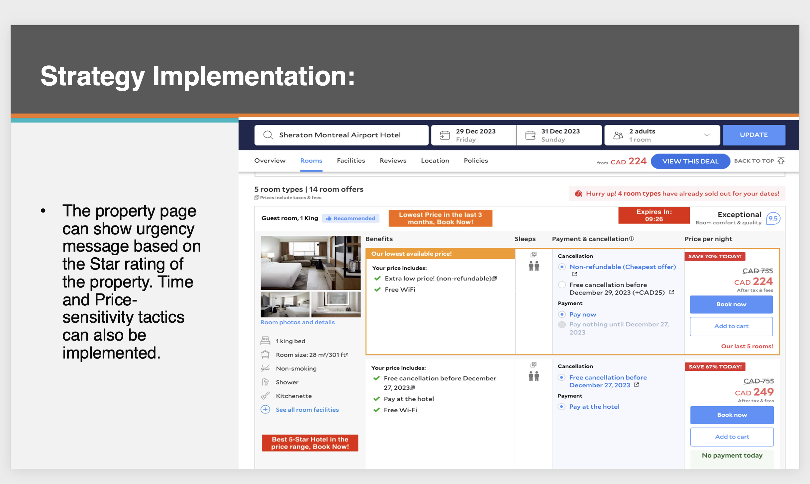

# Agoda Booking Analysis

Explore booking patterns, average daily rates (ADR), and booking lead time across five cities to develop hypotheses for truthful urgency messaging.

## Quick start

Python 3.10 or later is required. From this repository:

```sh
python -m venv .venv
source .venv/bin/activate
# Windows: .venv\Scripts\activate
python -m pip install -r requirements.txt
python analysis.py --demo
```

The demo creates reproducible **synthetic bookings**, CSV summaries, six charts, and a data quality report under `outputs/demo/`. It demonstrates functionality; its results are not Agoda business findings.

For interactive analysis:

```sh
jupyter lab Project_Agoda.ipynb
```

Run all cells in order. The notebook uses the same analysis functions as the command line.

## Analyze the original workbook

The original `Case_Study_Urgency_Message_Data.xlsx` is **not included** in this repository. Supply your own copy:

```sh
python analysis.py --input /path/to/Case_Study_Urgency_Message_Data.xlsx
```

For the notebook, set `DEMO = False` and update `WORKBOOK`. Real workbook results are saved under `outputs/workbook/`; the source workbook is not modified.

The workbook must contain `City_A`, `City_B`, `City_C`, `City_D`, and `City_E` sheets. Each row represents one booking. Every sheet requires:

| Column | Expected value |
| --- | --- |
| `booking_date` | Booking calendar date |
| `checkin_date` | Check-in date on or after booking |
| `checkout_date` | Check-out date strictly after check-in |
| `ADR_USD` | Finite positive daily rate in USD |
| `city_id` | Nonempty city identifier |
| `star_rating` | Number from 0 to 5 |
| `accommodation_type_name` | Nonempty accommodation type |

The original spelling `accommadation_type_name` is accepted and normalized. Missing sheets or columns produce explicit errors. Invalid rows are excluded and counted in `data_quality.json`. No automatic deduplication is performed because the booking identifier is unspecified.

## Outputs

- Daily and monthly booking counts and mean booked ADR.
- City, accommodation, star rating, and lead-time summaries.
- Nonoverlapping lead-time intervals: 0, 1–2, 3–4, 5–14, 15–29, and 30+ days.
- Six PNG charts and corresponding CSV tables.

Monthly summaries preserve the year. Counts use rows, independent of an optional `#` field. Empty lead-time buckets have zero bookings and missing mean rates.

## Interpretation

This is descriptive analysis, not a validated price forecasting or conversion model. Differences in booked ADR do not prove a specific room's future price movement. Scarcity, discount, deadline, and visitor-count claims need actual inventory, pricing, and event data. Evaluate message effectiveness using a controlled experiment.

The [original presentation](Agoda%20Case%20Study.pptx) and screenshots below are historical artifacts. Their original numerical conclusions cannot be revalidated without the missing workbook.



## Verification

```sh
python -m unittest discover -s tests -v
python analysis.py --demo
```

`analysis.py` contains shared loading, validation, aggregation, plotting, and command-line functions. `Project_Agoda.ipynb` provides the interactive workflow. Generated results and local environments are ignored by Git.
